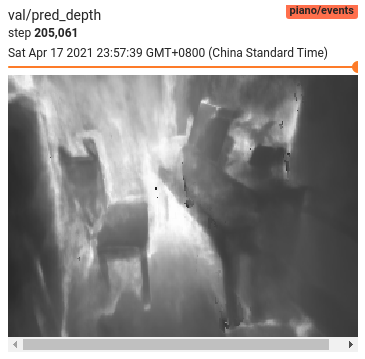
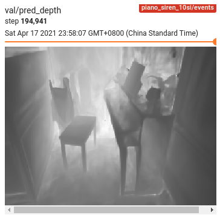
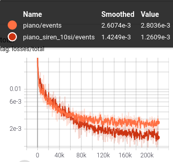
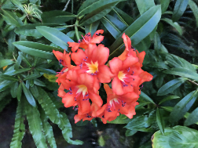
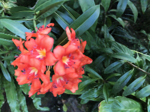
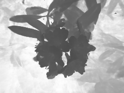
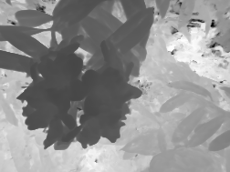
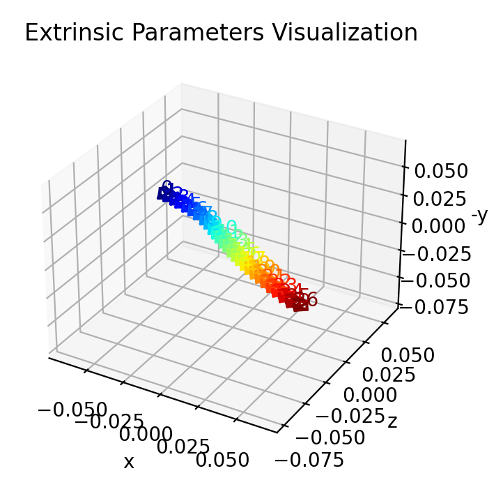

# [Unofficial code-base] NeRF--: Neural Radiance Fields Without Known Camera Parameters

### [ [Project](https://nerfmm.active.vision/) | [Paper](https://arxiv.org/abs/2102.07064) | [Official code base ](https://github.com/ActiveVisionLab/nerfmm)] :arrow_left: Thanks the original authors for the great work! 

- :warning: This is an :heavy_exclamation_mark: **unofficial** :heavy_exclamation_mark: pytorch re-implementation of the paper *NeRF--: Neural Radiance Fields Without Known Camera Parameters*.
- I have reproduced the results on the LLFF-fern dataset, LLFF-flower dataset, personal photos, and some YouTube video clips chosen by myself.
- This repo contains implementation of **both the original paper and my personal modifications & refinements**.

## Example results

| input                                    | raw images of the same scene (order doesn't matter, could be in **arbitrary order**) |
| ---------------------------------------- | ------------------------------------------------------------ |
| **output**<br>(after joint optimization) | camera intrinsics (focal_x and focal_y)<br>camera extrinsics (inverse of poses, rotations and translations) of each image<br>a 3D implicit representation framework [[NeRF]](https://www.matthewtancik.com/nerf) that models both appearance and geometry of the scene |

#### Source 1: random [YouTube video](https://www.youtube.com/watch?v=hWagaTjEa3Y) clips, time from `00:10:36` to `00:10:42`

<table>
<thead align="center">
  <tr>
    <th></th>
    <th>ReLU-based NeRF--<br>(no refinement, stuck in local minima)</th>
    <th>SIREN-based NeRF--<br>(no refinement)</th>
  </tr>
</thead>
<tbody>
  <tr>
    <td>input<br>32 raw photos, sampled at 5 fps<br>32 x [540 x 960 x 3]</td>
    <td colspan="2" align="center"></td>
  </tr>
  <tr>
    <td>learned scene model size</td>
    <td align="center" colspan="2">1.7 MiB / 158.7k params<br>8+ MLPs with width of 128</td>
  </tr>
  <tr>
    <td>learned camera poses</td>
    <td></td>
    <td></td>
  </tr>
  <tr>
    <td>predicted rgb<br>(appearance)<br>(with novel view synthesis)</td>
    <td></td>
    <td></td>
  </tr>
  <tr>
    <td>predicted depth<br>(geometry)<br>(with novel view synthesis)</td>
    <td></td>
    <td></td>
  </tr>
</tbody>
</table>

#### Source 2: random [YouTube video](https://www.youtube.com/watch?v=hWagaTjEa3Y) clips, time from `00:46:17` to `00:46:28`

<table>
<thead align="center">
  <tr>
    <th></th>
    <th>ReLU-based NeRF--<br>(with refinement, still stuck in local minima)</th>
    <th>SIREN-based NeRF--<br>(with refinement)</th>
  </tr>
</thead>
<tbody>
  <tr>
    <td>input<br>27 raw photos, sampled at 2.5 fps<br>27 x [540 x 960 x 3]</td>
    <td colspan="2" align="center"></td>
  </tr>
  <tr>
    <td>learned scene model size</td>
    <td align="center" colspan="2">1.7 MiB / 158.7k params<br>8+ MLPs with width of 128</td>
  </tr>
  <tr>
    <td>learned camera poses</td>
    <td></td>
    <td></td>
  </tr>
  <tr>
    <td>predicted rgb<br>(appearance)<br>(with novel view synthesis)</td>
    <td></td>
    <td></td>
  </tr>
  <tr>
    <td>predicted depth<br>(geometry)<br>(with novel view synthesis)</td>
    <td></td>
    <td></td>
  </tr>
</tbody>
</table>

#### Source 3: photos by [@crazyang](https://github.com/yzy1996)

<table>
<thead align="center">
  <tr>
    <th></th>
    <th>ReLU-based NeRF--<br>(no refinement)</th>
    <th>SIREN-based NeRF--<br>(no refinement)</th>
  </tr>
</thead>
<tbody>
  <tr>
    <td>input<br>22 raw photos<br>22 x [756 x 1008 x3]</td>
    <td colspan="2" align="center"></td>
  </tr>
  <tr>
    <td>learned scene model size</td>
    <td align="center" colspan="2">1.7 MiB / 158.7k params<br>8+ MLPs with width of 128</td>
  </tr>
  <tr>
    <td>learned camera poses</td>
    <td></td>
    <td></td>
  </tr>
  <tr>
    <td>predicted rgb<br>(appearance)<br>(with novel view synthesis)</td>
    <td></td>
    <td></td>
  </tr>
  <tr>
    <td>predicted depth<br>(geometry)<br>(with novel view synthesis)</td>
    <td></td>
    <td></td>
  </tr>
</tbody>
</table>

Notice that the `reflectance` of the piano's side is misunderstood as `transmittance`, which is reasonable and acceptable since no prior of the shape of the piano is provided.

## What is NeRF and what is NeRF--

### NeRF

[NeRF](https://arxiv.org/abs/2003.08934) is a neural (differentiable) rendering framework with great potentials. Please view [[NeRF Project Page]](https://www.matthewtancik.com/nerf) for more details.

It represents scenes as a continuous function (typically modeled by several layers of MLP with non-linear activations); the same ideas within [DeepSDF](https://arxiv.org/abs/1901.05103), [SRN](https://arxiv.org/abs/1906.01618), [DVR](https://arxiv.org/abs/1912.07372), and so on.

It is suggested to refer to [[awesome-NeRF]](https://github.com/yenchenlin/awesome-NeRF) and [[awesome-neural-rendering]](https://github.com/weihaox/awesome-neural-rendering) to catch up with recent 'exploding' development in these areas.

### NeRF--

[NeRF--](https://arxiv.org/abs/2102.07064) modifies the original NeRF from requiring known camera parameters to supporting unknown and learnable camera parameters. 

- **NeRF--** does the following work in the training process:
  - Joint optimization of 
    - camera intrinsics
    - camera extrinsics 
    - a NeRF model (appearance and geometry)  
  - Using pure raw real-world images and using just photometric loss (image reconstruction loss).
- `SfM+MVS`
  - In other words, NeRF-- tackles exactly the same problem with what a basic `SfM+MVS` system like `COLMAP` does, but learns the camera parameters, geometry and appearance of the scene simultaneously in a more natural and holistic way, requiring no hand-crafted feature extraction procedures like `SIFT` or points, lines, surfaces etc.
- **How?**
  - Since NeRF is a neural rendering framework (which means the whole framework is **differentiable**), one can directly compute the gradients of the photometric loss with respect to the camera parameters.
- :rocket: **Wide future of NeRF-based framework --- vision by inverse computer graphics**

  - Expect more to come! Imagine direct computing of gradients of photometric loss w.r.t. illumination? object poses? object motion? object deformation? objects & background decomposition ? object relationships?...

## My modifications & refinements / optional features

This repo first implements NeRF-- with nothing changed from the original paper. But it also support the following optional modifications, and will keep updating.

All the options are configured using `yaml` configuration files in the [configs](configs) folder. See details about how to use these configs [in the configuration section](#configuration).

### SIREN-based NeRF as backbone

Replace the ReLU activations of NeRF with sinusoidal(sin) activation. Codes borrowed and modified from [[lucidrains' implementation of pi-GAN]](https://github.com/lucidrains/pi-GAN-pytorch). Please refer to [SIREN](https://vsitzmann.github.io/siren/) and [pi-GAN](https://marcoamonteiro.github.io/pi-GAN-website/) for more theoretical details. 

To config:

```yaml
model:
  framework: SirenNeRF # options: [NeRF, SirenNeRF]
```

#### :pushpin: SIREN-based NeRF compared with ReLU-based NeRF

- `SirenNeRF` could lead to smoother learned scenes (especially smoother shapes). (below, left for ReLU-based, right for SIREN-based)

| ReLU-based NeRF-- (no refinement)                      | SIREN-based NeRF-- (no refinement)          |
| ------------------------------------------------------ | ------------------------------------------- |
|  |  |

- `SirenNeRF` could lead to better results (smaller losses at convergence, better SSIM/PSNR metrics) .



>  The above two conclusions are also evidenced by the `DeepSDF` results shown in the [SIREN project](https://vsitzmann.github.io/siren/).

- `SirenNeRF` is a little bad for scenes with lots of sharp and messy edges (for its continuously differentiable & smoothing nature).

e.g. LLFF-flower scene

| ReLU-based NeRF-- (with refinement)        | SIREN-based NeRF-- (with refinement)         |
| ------------------------------------------ | -------------------------------------------- |
|      |      |
|  |  |

> **Note:** since the raw output of `SirenNeRF` is relatively slower to grow, I multiply the raw output (sigma) of `SirenNeRF` with a factor of ~~10~~ 30. To config, use `model:siren_sigma_mul`

### [WIP] Perceptual model

For fewer shots with large viewport changes, I add an option to use a perceptual model ([CLIP](https://github.com/openai/CLIP)) and an additional perceptual loss along with the reconstruction loss, as in [DietNeRF](https://www.ajayj.com/dietnerf).

To config:

```yaml
data:
  N_rays: -1 # options: -1 for whole image and no sampling, a integer > 0 for number of ray samples
training:
  w_perceptual: 0.01 # options: 0. for no perceptual model & loss, >0 to enable
```

> **Note**: as the [CLIP](https://github.com/openai/CLIP) model requires at least `224x224` resolution and a whole image (not sampled rays) as input
>
>   - `data:N_rays` must set to `-1` for generating whole images when training
>   - `data:downscale` must set to a proper value, and a GPU with larger memory size is required
>     - or proper up-sampling is required
>

### More choices of rotation representations / intrinsics parameterization

- rotation representation

Refer to [this paper](https://arxiv.org/pdf/1812.07035.pdf) for theoretical suggestions for different choices of `SO(3)` representations.

To config:

```yaml
model:
  so3_representation: 'axis-angle' # options: [quaternion, axis-angle, rotation6D]
```

- intrinsics parameterization

To config:

```yaml
model:
  intrinsics_representation: 'square' # options: [square, ratio, exp]
```

## Usage

### hardware

- :computer: OS: tested on Ubuntu 16 & 18
- GPU (all assume 1024 ray samples(by default) + 756 x 1000 resolution + 128 network width)
  - scene model parameter size
    - :star2: `1.7 MiB` for `float32`.  
    - For NeRF scene model, it's just 8+ layers of MLPs with ReLU/sin activation, with width of 128.
  - :clock1: training time on 2080Ti
    - <10 mins or 0-200 epochs:  learning poses mainly, and rough appearances
    - ~4 hours, from ~300 to 10000 epochs: the poses has little further changes; the NeRF model learns fine details (geometry & appearance) of the scene
  - GPU memory:
    - (training) ~3300 MiB GPU memory usage
    - (testing / rendering) lower GPU memory usage, but potentially more GPU usage since testing is on full resolution, while training is on a small batch of sampled pixel for each iteration.

### software

- Python >= 3.5

- To install requirements, run:

    - Simply just run: (suggested used in anaconda environments):

        ```shell
        ## install torch & cuda & torchvision using your favorite tools, conda/pip
        # pip install torch torchvision
        
        ## install other requirements
        pip install numpy pyyaml addict imageio imageio-ffmpeg scikit-image tqdm tensorboardX "pytorch3d>=0.3.0" opencv-python
        ```

    - Or

        ```shell
        conda env create -f environment.yml
        ```

- Before running any python scripts for the first time, `cd`  to the project root directory and add the root project directory to the `PYTHONPATH` by running:

    ```shell
    cd /path/to/improved-nerfmm
    source set_env.sh
    ```

### configuration

There are three choices for giving configuration values:

- [DO NOT change] [configs/base.yaml](configs/base.yaml) contains all the default values of the whole config.
- [Your playground] Specific config yamls in [configs](configs/) folder are for specific tasks. You only need to put related config keys here. It is given to the python scripts using `python xxx.py --config /path/to/xxx.yaml`.
  - e.g. [configs/fern.yaml](configs/fern.yaml) for training LLFF-fern datasets.
- You can also give additional runtime command-line arguments with `python xxx.py --xxx:yyy val`, to change the config dict: `'xxx':{'yyy': val}`

The configuration overwriting priority order:

- `command line args`   >>overwrites>>    `--config /path/to/xxx.yaml`    >>overwrites>>    `configs/base.yaml`

### data

| dataset source                                          | link / script                                                | file path                                |
| ------------------------------------------------------- | ------------------------------------------------------------ | ---------------------------------------- |
| LLFF                                                    | Download LLFF example data using the scripts (run in project root directory):<br>`bash dataio/download_example_data.sh` | (automatic)                              |
| Youtube video clips                                     | https://www.youtube.com/watch?v=hWagaTjEa3Y                  | ./data/castle_1041<br>./data/castle_4614 |
| piano photos by [@crazyang](https://github.com/yzy1996) | [Google-drive](https://drive.google.com/drive/folders/1zD9tKku6C-2O3KGxPQnumXKz4AR1qkHl?usp=sharing) | ./data/piano                             |

### pre-trained models

You can get pre-trained models in either of the following two ways:

- Clone the repo using `git-lfs`, and you will get the pre-trained models and configs in `pretrained` folder.
- From `pretrained` folder in the [google-drive](https://drive.google.com/drive/folders/1zD9tKku6C-2O3KGxPQnumXKz4AR1qkHl?usp=sharing)


## Training

Before running any python scripts for the first time, `cd`  to the project root directory and add the root project directory to the `PYTHONPATH` by running:

```shell
cd /path/to/improved-nerfmm
source set_env.sh
```

### Train on example data (without refinement)

Download LLFF example data using the scripts (run in project root directory)

```shell
bash dataio/download_example_data.sh
```

Start training:

```shell
python train.py --config configs/fern.yaml
```

- To specify used GPUs: (e.g. `2` and `3`) (in most cases, one GPU is quite enough.)

    ```shell
    python train.py --config configs/fern.yaml --device_ids 2,3
    ```

  - Currently, this repo use `torch.DataParallel` for multi-GPU training.

- View the training logs and stats output in the experiment folder: `./logs/fern` 

- Run `tensorboard` to monitor the training process:

    ```shell
    tensorboard --logdir logs/fern/events
    ```

- To resume previously interrupted training:

    ```shell
    python train.py --load_dir logs/fern
    ```

  - > **Note**: Full config is automatically backed up in the experiment directory when start training. Thus when loading from a directory, the scripts will only read from `your_exp_dir/config.yaml`,  and `configs/base.yaml` will not be used.

### :rocket: Train on your own data

- :pushpin:**Note on suitable input**
  - ①static scene ②forward-facing view ③with small view-port changes.
    - Smaller viewport change / forward facing views
      - So that a certain face of a certain object should appear in all views
      - Otherwise the training would fail in the early stages (failed to learn reasonable camera poses, and hence no chance for the NeRF). 
      - This is mostly because it processes all input images at once.
    - No moving / deforming objects. (e.g. a car driving across the street, a bird flying across the sky, people waving hands)
    - No significant illumination/exposure changes.  (e.g. camera moving from pointing towards the sun to back to the sun)
    - No focal length changes. Currently assume all input share the same camera intrinsics.
    - **Just temporarily!** (All imaginable limitations have imaginable solutions. Stay tuned!)

- :pushpin: **Note on training**
  - When training with no refinement, the training process is roughly split into two phases:
    - [0 to about 100-300 epochs] The NeRF model learns some rough blurry pixel blocks, and these rough blocks helps with optimizing the camera extrinsics.
    - [300 epochs+ to end] The camera extrinsics are almost fixed, with very small further changes; the NeRF model learns the fine details of the scene.
  - You should monitor the early 100~300 epochs of the training process. If no meaningful camera poses (especially the `camera translation on xy-plane`) are learned during this early stages, there almost won't be any miracle further.
  - I have not tested on >50 images, but you can give it a try.
  
- First, prepare your photos and put them into one separate folder, say `/path/to/your_photos/xxx.png`.

- Second:

  - Write a new config file for your data: (you can put any config key mentioned in [configs/base.yaml](configs/base.yaml))

      ```yaml
      expname: your_expname
      data:
        data_dir: /path/to/your_photos
        #=========
        N_rays: 1024 # numer of sampled rays in training.
        downscale: 4.
        #=========
      ```
      
  - And run
  
    ```shell
    python train.py --config /path/to/your_config.yaml
    ```
    
  - Or you can use some existing config file and run: 
  
      ```shell
      python train.py --config /path/to/xxx.yaml --data:data_dir /path/to/your_photos --expname your_expname
      ```
  
- The logging and stats would be in `logs/your_expname` folder.

- Monitor the training process with:

    ```shell
    tensorboard --logdir logs/your_expname/events
    ```

### Train on video clips

- First, clip your `video.mp4` with `ffmepg`.

    ```shell
    ffmpeg -ss 00:10:00 -i video.mp4 -to 00:00:05 -c copy video_clip.mp4
    ```

  - > **Note**:
    >
    > - time format: `hh:mm:ss.xxx`
    > - `-ss` means starting timestamp
    > - `-to` means **duration length**, not end timestamp.

- Second, convert `video_clip.mp4` into images:

    ```shell
    mkdir output_dir
    ffmpeg -i video_clip.mp4 -filter:v fps=fps=3/1 output_dir/img-%04d.png
    ```

  - > **Note**:
    >
    > - `3/1` means 3 frames per second. `3` is the nominator, `1` is the denominator.

- Then train on your images with instructions in [:rocket: ​Train on your own data](#:rocket:-Train-on-your-own-data)

### Automatic training with a pre-train stage and refine stage

Run

```shell
python train.py --config ./configs/fern_prefine.yaml
```

Or

```shell
python train.py --config ./configs/fern.yaml --training:num_epoch_pre 1000 --expname fern_prefine
```

You can also try on your own photos using similar configurations.

### Refining a pre-trained NeRF--

This is the step suggested by original NeRF-- paper: drop all pre-trained parameters except for camera parameters, and refine.

For example, refine a pre-trained LLFF-fern scene, with original config stored in `./configs/fern.yaml`, a pre-trained checkpoint in `./logs/fern/ckpts/final_xxxx.pt`, and with a new experiment name `fern_refine`:

```shell
python train.py --config ./configs/fern.yaml --expname fern_refine --training:ckpt_file ./logs/fern/ckpts/final_xxxx.pt  --training:ckpt_only_use_keys cam_params
```

> **Note**:
>
> - `--training:ckpt_only_use_keys cam_params` is used to drop all the keys in the pre-trained `state_dict` except `cam_params` when loading the checkpoints. 
>   - Some warnings like `Could not find xxx in checkpoint` will be prompted, which is OK and is the exact desired behavior.
> - a new `expname` is specified and hence a new experiment directory would be used, since we do not want to concatenate and mix the new logging stats with the old ones.
>

## Testing

### Free view port rendering

- To render with `camera2world` matrices interpolated from the learned pose

```shell
python tools/free_viewport_rendering.py --load_dir /path/to/pretrained/exp_dir --render_type interpolate
```

- To render with spiral camera paths as in the original NeRF repo

```shell
python tools/free_viewport_rendering.py --load_dir /path/to/pretrained/exp_dir --render_type spiral
```

### Visualize learned camera pose

```shell
python tools/plot_camera_pose.py --load_dir /path/to/pretrained/exp_dir
```

Notice that the learned camera `phi` & `t` is actually for `camera2world` matrices, the inverse of `camera extrinsics`

You will get a `matplotlib` window like this:



## Road-map & updates

### Basic NeRF model

- [x] `2021-04-17` Basic implementation of the original paper, including training & logging
  - [x] Add `quaternion`, `axis-angle`, `rotation6D` as the rotation representation
  - [x] Add `exp`, `square`, `ratio` for different parameterizations of camera focal_x and focal_y
  - [x] Siren-ized NeRF
  - [x] refinement process as in the original NeRF-- paper
- [ ] Change `DataParallel` to `DistributedDataParallel`

### Efficiency & training

- [x] `2021-04-19` Add pre-train for 1000 epochs then refine for 10000 epochs, similar with the [official code base](https://github.com/ActiveVisionLab/nerfmm).

- [ ] tolist - recent works in speeding up NeRF

### More experiments

- [ ] vSLAM tasks and datasets
- [ ] traditional SfM datasets
- [x] `2021-04-15` raw videos handling

### Better SfM strategy

- [ ] tolist

### More applicable for more scenes

- [ ] NeRF++ & NeRF-- for handling unconstrained scenes
- [ ] NeRF-W
- [ ] some dynamic NeRF framework for dynamic scenes

- [ ] Finish perceptual loss, for fewer shots

## Related/used code bases

- [GRAF](https://github.com/autonomousvision/graf) :arrow_left:  The configuration, logging and checkpoints scripts is borrowed and modified from here.
- [lucidrains' implementation of pi-GAN](https://github.com/lucidrains/pi-GAN-pytorch)
- [SIREN](https://github.com/vsitzmann/siren)

## Citations

- NeRF--

```
@article{wang2021nerf,
  title={Ne{RF}$--$: Neural Radiance Fields Without Known Camera Parameters},
  author={Wang, Zirui and Wu, Shangzhe and Xie, Weidi and Chen, Min and Prisacariu, Victor Adrian},
  journal={arXiv preprint arXiv:2102.07064},
  year={2021}
}
```

- SIREN

```
@inproceedings{sitzmann2020siren,
  author={Sitzmann, Vincent and Martel, Julien NP and Bergman, Alexander W and Lindell, David B and Wetzstein, Gordon},
  title={Implicit neural representations with periodic activation functions},
  booktitle={Proc. NeurIPS},
  year={2020}
}
```

- Perceptual model / semantic consistency from DietNeRF

```
@article{jain2021dietnerf,
  title={Putting NeRF on a Diet: Semantically Consistent Few-Shot View Synthesis},
  author={Ajay Jain and Matthew Tancik and Pieter Abbeel},
  journal={arXiv},
  year={2021}
}
```

